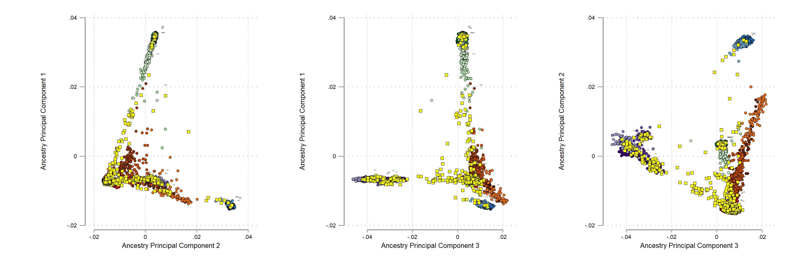

# bim2ancestry
__Author:__ Richard Anney
__Edited:__ 30 Mar 2020
__Current Version:__ v2

__Overview__
This function runs a set of modules to define the top 10 principal components (PC's) based on ancestry for a set of ``plink`` binaries, mapped against a reference set of genotypes of known ancestry. The test ``plink`` file format must include data harmonisation using ``genotypeqc``. 

__Dependencies__
The function has the following dependencies are ;
``bim_path_to_short`` ``bim2rymk`` ``bim2eigenvec`` ``checkfile`` ``checktabbed`` ``files2dta``  ``ref_path_to_short`` 

__Input Files__
For more details on input files see [input files](https://github.com/ricanney/stata/blob/master/input-files.md).

_Test data files_
This includes the full ``*.bed`` ``*.bim`` and ``*.fam`` for the test data. Data should be harmonised using ``genotypeqc``

_Reference data files_
This includes the full ``*.bed`` ``*.bim`` and ``*.fam`` for the reference data. Data should be harmonised using ``genotypeqc`` - currently using the genotypes ``all-1000g-phase3-chrall-mac5-v2``. ``all-1000g-phase3-chrall-mac5-v2`` has been harmonised to remove / correct non-standard genotypes that flag as an error in ``recodegenotypes``. 

In addition to ``*.bed`` ``*.bim`` and ``*.fam`` the path / file should also include ;
1. ``*.population`` - this contains three variables ``fid`` ``iid`` and ``pop``. The ``pop`` variable lists the included population codes from the reference datasets e.g. gbr = British, fin = Finnish etc. 
2. ``*.aims`` - this contains a list of ancestry informative markers derived for the population (fst > .05)

```
# creating the *.aims file
import delim using all-1000g-phase3-chrall-mac5-v2.population, clear varnames(1)
outsheet fid iid pop using all-1000g-phase3-chrall-mac5-v2.within, replace noq
!plink --bfile all-1000g-phase3-chrall-mac5-v2 ///
--fst ///
--within all-1000g-phase3-chrall-mac5-v2.within ///
--out all-1000g-phase3-chrall-mac5-v2
import delim using all-1000g-phase3-chrall-mac5-v2.fst, clear
keep snp fst
drop if fst == "nan"
destring fst, replace
keep if fst > .05
outsheet using all-1000g-phase3-chrall-mac5-v2.aims, non noq replace
```

__Syntax__

```
global bim <path>/plink_binary
global ref <path>/all-1000g-phase3-chrall-mac5-v2
bim2ancestry, bim(${bim}) ref(${ref})
```

__Pipeline__
1. limit ``reference`` and ``test`` to ``*.aims`` subset of marker. create: ``reference-aims`` ``test-aims``
2. limit ``reference-aims`` ``test-aims`` to non-ambiguous markers using ``bim2rymk``. create: ``reference-aims-rymk`` ``test-aims-rymk``
3. limit ``reference-aims-rymk`` ``test-aims-rymk`` to common SNPs between files
4. flip error and merge ``reference-aims-rymk`` ``test-aims-rymk`` create: ``common-aims-rymk``
5. calculate eigenvectors using ``bim2eigenvec``. create: ``*_eigenvec.dta``
6. merge into final ``*_eigenvec.dta`` with ``*.population``. create: ``*-bim2ancestry-merged_population.dta``
7. plot ``PC1`` ``PC2`` and ``PC3`` against one another from ``*-bim2ancestry-merged_population.dta``. create: ``*-bim2ancestry_pca.gph`` ``-bim2ancestry_pca1-pca2.gph`` ``-bim2ancestry_pca1-pca3.gph``  ``-bim2ancestry_pca2-pca3.gph`` 

__Output Files__
The files are deposited in the root directory in a sub-directory ``/bim2ancestry/<test>``. 
1. ``*-bim2ancestry-merged_population.dta``
2. ``*-bim2ancestry_pca.gph``
3. ``-bim2ancestry_pca1-pca2.gph``
4. ``-bim2ancestry_pca1-pca3.gph``
5. ``-bim2ancestry_pca2-pca3.gph`` 


__bim2ancestry-merged_population.dta file format__

The ``*-bim2ancestry-merged_population.dta`` file contains the following  variables.

| Variable Name | Storage Type | Variable Label | Notes |
|--------|--------|--------|--------|
|``fid``|str12|Family Identifier| .|
|``iid``|str12|Individual Identifier|.|
|``pop``|str4|Population|.|
|``pc1``|double|Ancestry Principal Component 1 |.
|...|double| |.
|``pc10``|double|Ancestry Principal Component 10 |.

__example graph__
This graph has been converted to png using the following command;
```
graph use "H:\software\stata\data\bim2ancestry\example\example-bim2ancestry_pca.gph"
graph export "H:\software\stata\data\bim2ancestry\example\example-bim2ancestry_pca.png", as(png) height(1000) width(3000) replace
```



Note that the _reference_ population ancestries are color-coded by super-population and the _test_ ancestries are rendered as yellow squares.

__example log file__
```
#########################################################################
# > .................. bim2ancestry
# > ........... author Richard Anney
# > ... report bugs to anneyr@cardiff.ac.uk
# >  code available at https://github.com/ricanney
# > .......... license CC BY-NC (CC Attribution-NonCommercial)
# > .................. all functions considered beta "caveat emptor"
#########################################################################
# Started:             30 Mar 2020 12:06:34 
# Username:            Richard Anney
# Operating System:    Windows
#########################################################################
# > ..... project name controls-combined-wtccc1
# > .... plink version H:/software/plink/bin/v1.9/plink_1.9b6.16-19feb2020.exe
# > ......... N in fam 3004
# > ........ reference all-1000g-phase3-chrall-mac5-v2
# > ..... saved graphs controls-combined-wtccc1-bim2ancestry_pca.gph
# > ..... saved graphs controls-combined-wtccc1-bim2ancestry_pca1-pca2.gph
# > ..... saved graphs controls-combined-wtccc1-bim2ancestry_pca1-pca3.gph
# > ..... saved graphs controls-combined-wtccc1-bim2ancestry_pca2-pca3.gph
# > ....... saved data controls-combined-wtccc1-bim2ancestry-merged_population.dta
#########################################################################
# > overview of bim2ancestry
#########################################################################
# > 1. limit to ancestry informative markers
# > 2. limit to RYMK SNPs
# > 3. remove incompatible SNPS (e.g. R/M or Y/K)
# > 4. limit to overlapping markers
# > 5. merge/flip/merge
# > 6. calculate eigenvectors (removing high ld regions)
# > 7. plot against reference populations
#########################################################################
```