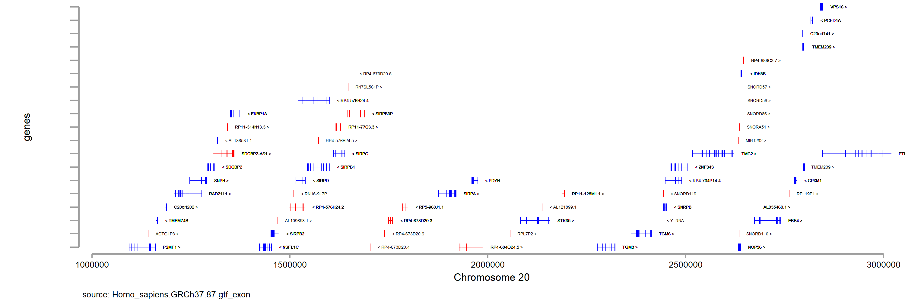

# graphgene
__Author:__ Richard Anney
__Edited:__ 1 Apr 2020
__Current Version:__ v4

__Overview__
This function creates the ``*.dta`` and ``*.gph`` for gene co-ordinates within a given ``range``. ``range`` is formatted as``chr<#>:<from#>..<to#>`` e.g. chr20:1000000..3000000.

__Dependencies__
The function has the following dependencies are ;
``checkfile`` ``files2dta`` ``gene_plotorder`` ``intersect_genes``

__Input Files__
* gene co-ordinate file ``Homo_sapiens.GRCh37._version_.gtf_exon.dta`` for gene plotting - create using ``create_generef``

__Options__
There are some additional flags that can be added to the syntax to adjust the plots
* ``png()`` - ``png(yes)`` renders the generated ``*.gph`` as ``*.png``
* ``label`` - ``label(off)`` drops the labels from the gene plot panel 
* `biotype`` - ``biotype(all)`` plots all transcripts in gene panel; ``biotype(protein_coding)`` limits gene plot panel to protein coding transcripts only (default = protein_coding) 

__Syntax__
```
global generef	H:/software/stata/data/graphgene_create_ref/Homo_sapiens.GRCh37.87.gtf/
graphgene, range(chr20:1000000..3000000) generef(${generef}) label(on) png(yes) biotype(all)
graphgene, range(chr20:1000000..3000000) generef(${generef}) label(on) png(yes) biotype(protein_coding)
```

__Output Files__
The script created the following files;
1. ``Homo_sapiens.GRCh37.87.gtf_exon-chr20_1000000_3000000_graphgene.dta`` - raw data for use with other graphing scripts e.g. ``graphlocuszoom``
2. ``Homo_sapiens.GRCh37.87.gtf_exon-chr20_1000000_3000000_graphgene.gph`` - Stata graph format
3. ``Homo_sapiens.GRCh37.87.gtf_exon-chr20_1000000_3000000_graphgene.png`` - rendered graph as ``*.png`` image




The files are deposited in the root directory in a sub-directory ``/graphgene/Homo_sapiens.GRCh37.87.gtf_exon``. All ranges are stored under the same input file. 
For ``range(chr20:1000000..3000000)`` the filename will be  will be ``Homo_sapiens.GRCh37.87.gtf_exon-chr20_1000000_3000000_graphgene.*``.

__example log file__
```
#########################################################################
# > .................. graphgene
# > ........... author Richard Anney
# > ... report bugs to anneyr@cardiff.ac.uk
# >  code available at https://github.com/ricanney
# > .......... license CC BY-NC (CC Attribution-NonCommercial)
# > .................. all functions considered beta "caveat emptor"
#########################################################################
# Started:              1 Apr 2020 15:56:22 
# Username:            Richard Anney
# Operating System:    Windows
#########################################################################
# > ..... project name Homo_sapiens.GRCh37.87.gtf_exon-chr20_1000000_3000000_graphgene
# >  co-ordinates file Homo_sapiens.GRCh37.87.gtf_exon
# > ..... genome build hg19
# > .............. chr chr20
# > ............. from 1000000
# > ............... to 3000000
# > ..... saved graphs Homo_sapiens.GRCh37.87.gtf_exon-chr20_1000000_3000000_graphgene.gph
# > ....... saved data Homo_sapiens.GRCh37.87.gtf_exon-chr20_1000000_3000000_graphgene.dta
#########################################################################
# > overview of graphgene
#########################################################################
# > 1. use reference co-ordinates
# > 2. select protein coding transcripts (adjustable in code)
# > 3. plot genes within defined boundaries
#########################################################################
```