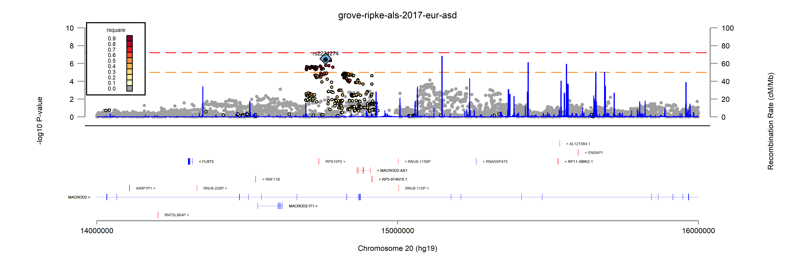

# graphlocuszoom
__Author:__ Richard Anney
__Edited:__ 7 Apr 2020
__Current Version:__ v3

__Overview__
This function creates the ``locuszoom`` style graph  - creating a ``*.gph`` ``*.dta`` and ``*.png`` - for an associated region. The graph overlays the association signal, recombination rate, gene co-ordinates and linkage disequilibrium data for a known SNP or genomic range. The function ideally runs from a ``summaryqc`` formatted data file, but will also work from an open dataset containing the variables ``snp`` ``chr`` ``bp`` and ``p``.

__Dependencies__
The function has the following dependencies are ;
``checkfile`` ``checktabbed`` ``files2dta`` ``gene_plotorder`` ``graphgene`` ``ref_path_to_short``

The graph also utilises the ``palettes`` function - see https://boris.unibe.ch/116571/1/Jann-2018-palettes.pdf

__Input Files__
* ``generef()`` - gene co-ordinate file ``Homo_sapiens.GRCh37._version_.gtf_exon.dta`` for gene plotting - create using ``create_generef``
* ``ldref()`` - reference genotypes ``gbr-1000g-phase3-chrall-mac5-v2`` for ld calculation - create using ``create_1000genomes``
* ``recombref()`` - recombination rate file ``genetic_map_HapMapII_GRCh37-recombination-rate.dta`` - create using ``create_recombref``

__Options__
There are some additional flags that can be added to the syntax to adjust the plots
* ``index()`` - sets the index SNP for the plot - can be used with range or by itself 
* ``summaryqc()`` - set the summaryqc file - note ``-summaryqc.dta`` is not needed when setting path of file
* ``project()`` - define project name - name taken from ``summaryqc`` if missing (or set as unknown) - project name cannot contain spaces
* ``gwsp()`` - define genome-wide significant p-vale (-log10 format; default = ``gwsp(7.3)``
* ``range()`` - define range of plot - can be used with index or by itself (range format; ``chr#:###..###``)
* ``png()`` - ``png(yes)`` renders the generated ``*.gph`` as ``*.png`` - default = ``png(no)``
* ``label`` - ``label(off)`` drops the labels from the gene plot panel - default = ``label(on)``
* ``biotype`` - ``biotype(all)`` plots all transcripts in gene panel; ``biotype(protein_coding)`` limits gene plot panel to protein coding transcripts only (default = all) 

The function ideally runs from a ``summaryqc`` formatted data file, but will also work from an open dataset containing the variables ``snp`` ``chr`` ``bp`` and ``p``. The script also needs either; ``index`` or ``range`` to be specified - you can specify both to control the plot

__Syntax__
```
global generef    H:/software/stata/data/create_generef/Homo_sapiens.GRCh37.87.gtf/
global recombref  H:/software/stata/data/create_recombref/genetic_map_HapMapII_GRCh37/genetic_map_HapMapII_GRCh37-recombination-rate.dta 
global ref        H:/software/stata/data/create_1000genomes/ftp.1000genomes.ebi.ac.uk/all-1000g-phase3-chrall-mac5-v2
global ldref      H:/software/stata/data/create_1000genomes/ftp.1000genomes.ebi.ac.uk/
global summaryqc  H:/software/stata/data/summaryqc/grove-ripke-als-2017-eur-asd/grove-ripke-als-2017-eur-asd

graphlocuszoom,  generef(${generef}) ldref(${ldref}) recombref(${recombref}) summaryqc(${summaryqc}) png(yes) index(rs2224274)
graphlocuszoom,  generef(${generef}) ldref(${ldref}) recombref(${recombref}) summaryqc(${summaryqc}) png(yes) range(chr20:14000000..16000000)

use ${summaryqc3}-summaryqc.dta, clear
keep chr snp bp p
graphlocuszoom, generef(${generef}) ldref(${ldref}) recombref(${recombref}) project(PGC-iPSYCH-ASD-GWAS-2019) png(yes) index(rs2224274)
```

__Output Files__
The script created the following files;
2. ``grove-ripke-als-2017-eur-asd-chr20_14000000_16000000_graphlocuszoom.gph`` - Stata graph format
3. ``grove-ripke-als-2017-eur-asd-chr20_14000000_16000000_graphlocuszoom.png`` - rendered graph as ``*.png`` image



The files are deposited in the root directory in a sub-directory ``/graphlocuszoom/<project or summaryqc>``. All ranges are stored under the same input file. 
For ``summaryqc(grove-ripke-als-2017-eur-asd)`` ``range(chr20:14000000..16000000)`` the naming convention is;
* subdirectory - ``/graphlocuszoom/grove-ripke-als-2017-eur-asd``
* filenames - ``grove-ripke-als-2017-eur-asd-chr20_14000000_16000000_graphlocuszoom.*``.

__example log file__
```
#########################################################################
# > .................. graphlocuszoom
# > ........... author Richard Anney
# > ... report bugs to anneyr@cardiff.ac.uk
# >  code available at https://github.com/ricanney
# > .......... license CC BY-NC (CC Attribution-NonCommercial)
# > .................. all functions considered beta "caveat emptor"
#########################################################################
# Started:              8 Apr 2020 11:29:51 
# Username:            Richard Anney
# Operating System:    Windows
#########################################################################
# > ..... project name grove-ripke-als-2017-eur-asd
# > ..... ld reference gbr-1000g-phase3-chrall-mac5-v2
# >  recombination ref genetic_map_HapMapII_GRCh37-recombination-rate.dta
# > ............ index rs2224274
# > ..... genome build hg19
# > .............. chr chr20
# > ............. from 14000000
# > ............... to 16000000
# > ..... saved graphs grove-ripke-als-2017-eur-asd-chr20_14000000_16000000_graphlocuszoom.gph
#########################################################################
# > overview of graphlocuszoom
#########################################################################
# > 1. identify index snp in data
# > 2. determine chromosome and region to plot
# > 3. define gene transcripts in region using graphgene
# > 4. calculate ld between index and snps in region using reference
# > 5. parse recombination rate for region
# > 6. combine data
# > 7. plot combined data
#########################################################################

```